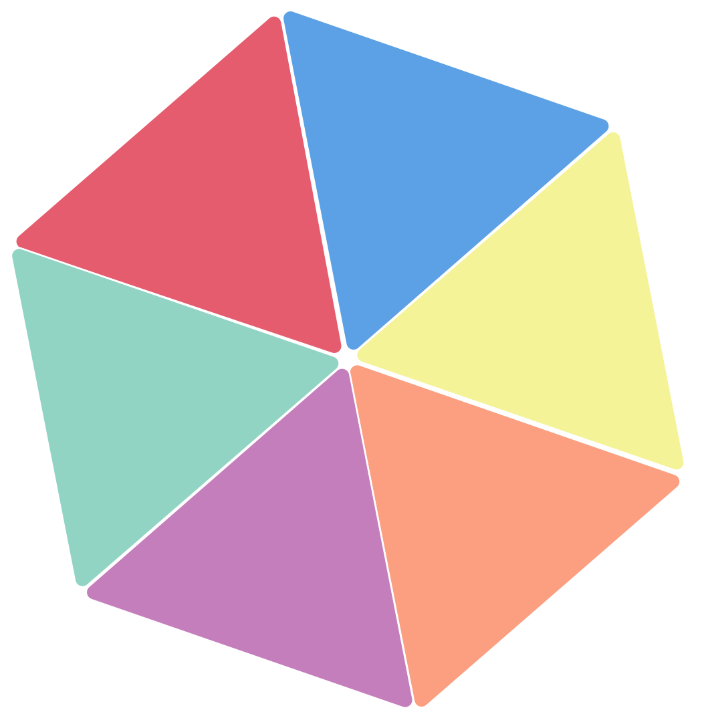

#  trim</dvi>

## 製品概要
ディベロッパー × Tech

### 背景(製品開発のきっかけ、課題等）
エンジニアがプログラムを書く際には **「キャメルケース」** **「スネークケース」** **「ケバブケース」** などの **「命名規則」** や **「1行のに記述する文字数の制限」** などの守らなければいけない **暗黙的なルール** が数多く存在する。

これらのルールを初心者が意識しながらプログラムを書くことは難しいという課題がある。
また、オンライン化が進む中、チーム開発をしている場合でも随時ルールを考慮して開発を進める必要がある。

私たちはこれらの課題を解決するサービスを作成する。

### 製品説明（具体的な製品の説明）
本製品は **ルールベースソースコードフォーマッター** のデスクトップ/ウェブ アプリです。

- 使用率が高いプログラミング言語である **Python** をフォーマットするアプリケーション
- プログラミング初心者でも綺麗なコードを作成することが可能
- チーム開発においても作成したルールをもとに統一されたコードフォーマットを提供

### 特長

#### 1. **フォーマットルール**の作成は初心者向けなわかりやすいGUIを提供
熟練のエンジニアがよく使用する命名規則やインデント数などをカスタマイズ可能で **CapWords** や **Snake** 表現を選択できます。
また、初心者向けにはデフォルトの値を設定しているため、迷うことがなくなります。

#### 2. 特長2

#### 3. 特長3

### 解決出来ること
### 今後の展望
### 注力したこと（こだわり等）
* 
* 

## 開発技術
### 活用した技術
#### API・データ
* 
* 

#### フレームワーク・ライブラリ・モジュール
* 
* 

#### デバイス
* 
* 

### 独自技術
#### ハッカソンで開発した独自機能・技術
* 独自で開発したものの内容をこちらに記載してください
* 特に力を入れた部分をファイルリンク、またはcommit_idを記載してください。

#### 製品に取り入れた研究内容（データ・ソフトウェアなど）（※アカデミック部門の場合のみ提出必須）
* 
* 

# 使用方法
使用方法については[Wiki](https://github.com/jphacks/D_2109/wiki)をご覧ください。